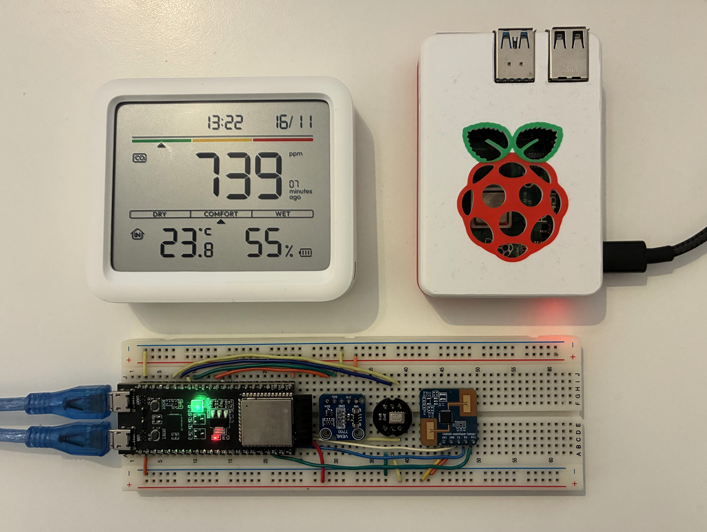
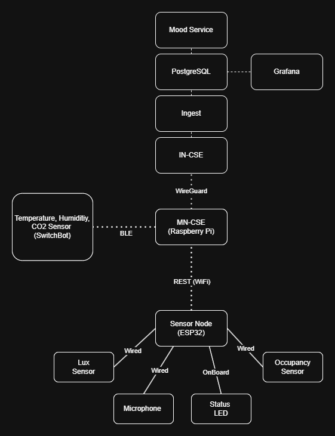

# Workspace Mood Monitor

**2025 International oneM2M Hackathon - Team VibeTribe**

An intelligent IoT system that continuously monitors workspace environmental conditions and transforms them into an intuitive "Workplace Mood Score" indicating whether your environment supports focus, neutral work, or causes fatigue.

[](https://www.hackster.io/vibetribe/workspace-mood-monitor-c71c26)



## The Problem

Modern workspaces are filled with activity, devices, and people, making them prone to unnoticed environmental issues such as noise, poor lighting, or stale air. These factors directly impact productivity, comfort, and well-being, yet often go unaddressed because:

- Manual environmental checks are tedious and inconsistent
- Individual factors (CO₂, noise, light) are hard to interpret without context
- Proprietary building management systems are expensive and inflexible
- Workers lack real-time feedback about their immediate environment

## Our Solution

The Workspace Mood Monitor automatically collects multi-dimensional environmental data and synthesizes it into a simple, actionable mood score. Workers get instant visual feedback via RGB LEDs (red = poor conditions, yellow = neutral, green = optimal), while managers can view historical trends and analytics through Grafana dashboards.

### Monitored Metrics

| Metric | Sensor | Purpose |
|--------|--------|---------|
| **Light Level** | VEML7700 | Ensures adequate illumination (lux) |
| **Sound Level** | INMP441 MEMS Microphone | Detects excessive noise |
| **Air Quality** | SwitchBot Meter Plus | Monitors CO₂ concentration |
| **Temperature** | SwitchBot Meter Plus | Tracks thermal comfort |
| **Humidity** | SwitchBot Meter Plus | Monitors moisture levels |
| **Occupancy** | S3KM1110 mmWave Radar | Detects desk usage |

### Key Features

- **Real-time Monitoring**: Continuous sensor data collection with 10-60 second intervals
- **Instant Feedback**: RGB LED indicators show current mood at each desk
- **oneM2M Standard**: Interoperable IoT data exchange using ACME CSE
- **Cloud Analytics**: Historical data storage and trend analysis in PostgreSQL
- **Beautiful Dashboards**: Grafana visualizations for insights and reporting
- **Scalable Architecture**: VPN-connected distributed nodes, cloud processing
- **Extensible Platform**: Add new sensors, rooms, or analytics with minimal effort

## System Architecture



### Component Overview

**Cloud Layer (VPS)**
- **IN-CSE (ACME CSE)**: Infrastructure Node oneM2M server, receives data from all sites
- **Ingest Service**: Flask-based normalizer, processes oneM2M notifications into canonical metrics
- **Mood Service**: FastAPI service computing workspace mood scores from sensor data
- **PostgreSQL**: Time-series database storing raw telemetry and computed mood scores
- **Grafana**: Dashboards and analytics visualization

**Local Site (Home/Office)**
- **Raspberry Pi MN-CSE**: Middle Node oneM2M server, bridges local sensors to cloud
- **SwitchBot BLE Service**: Python service reading CO₂/temp/humidity from BLE sensor
- **ESP32-S3 Sensor Node**: Multi-sensor device with light, audio, occupancy sensors and RGB LED feedback

**Network**
- **WireGuard VPN**: Secure tunnel connecting distributed sites (10.100.0.0/24)
- **oneM2M Protocol**: Standard IoT data exchange via HTTP/REST

### Data Flow

1. **Sensor Collection**
   - ESP32 reads light, audio, and occupancy sensors every 10 seconds
   - SwitchBot Meter Plus broadcasts CO₂, temperature, humidity via BLE
   - Raspberry Pi scanner decodes BLE data every 60 seconds

2. **Local Processing (MN-CSE)**
   - Both services create/update oneM2M FlexContainer resources
   - Data is stored locally in the Raspberry Pi's MN-CSE (ACME)
   - Announced resources are visible to cloud IN-CSE

3. **Cloud Ingestion**
   - IN-CSE subscription triggers notifications to Ingest Service
   - Ingest normalizes payloads (handles synonyms, type coercion)
   - Raw and normalized data persisted to PostgreSQL

4. **Mood Computation**
   - Mood Service receives normalized telemetry
   - Heuristic algorithm computes score (0-100) based on:
     - CO₂ levels (cognitive performance)
     - Noise levels (distraction factor)
     - Light levels (visibility and alertness)
     - Temperature and humidity (thermal comfort)
     - Occupancy (desk usage context)
   - Result: `{score: 78, label: "focus", timestamp: ...}`

5. **Feedback Loop**
   - Mood Service posts score as new CIN to IN-CSE
   - ESP32 subscribes to mood changes via oneM2M notifications
   - LED color updates instantly: Green (focus), Yellow (neutral), Red (tired)

6. **Visualization**
   - Grafana queries PostgreSQL for historical data
   - Dashboards show real-time gauges, time-series trends, and tables

## Repository Structure

```
WorkspaceMoodMonitor/
├── README.md                      # This file - project overview
├── LICENSE                        # MIT License
├── images/                        # Documentation images
│   ├── full_architecture.png      # System architecture diagram
│   ├── full_hardware.jpg          # Complete hardware setup photo
│   └── sensornode.jpg             # ESP32 sensor node detail
│
├── esp32_sensornode/              # ESP32-S3 sensor node firmware
│   ├── README.md                  # ESP32 documentation
│   ├── platformio.ini             # Build configuration
│   ├── include/                   # Header files
│   │   ├── config.h               # WiFi, CSE settings
│   │   ├── onem2m.h               # oneM2M protocol
│   │   ├── lux_sensor.h           # VEML7700 interface
│   │   ├── audio_sensor.h         # INMP441 interface
│   │   ├── occupancy_sensor.h     # S3KM1110 interface
│   │   └── led_actuator.h         # NeoPixel + subscription handler
│   └── src/                       # Implementation files
│       ├── main.cpp
│       ├── onem2m.cpp
│       ├── lux_sensor.cpp
│       ├── audio_sensor.cpp
│       ├── occupancy_sensor.cpp
│       └── led_actuator.cpp
│
├── raspberry_mn-cse/              # Raspberry Pi MN-CSE + BLE sensor
│   ├── README.md                  # Raspberry Pi documentation
│   ├── docker-compose.yml         # Service orchestration
│   ├── .env.example               # Configuration template
│   ├── wireguard_tutorial.md      # VPN setup guide
│   ├── cse/                       # ACME CSE data volume
│   └── sensor/                    # SwitchBot BLE service
│       ├── Dockerfile.sensor
│       └── switchbot-sensor.py    # Python BLE scanner
│
└── cloud/                         # Cloud analytics platform
    ├── README.md                  # Cloud platform documentation
    ├── docker-compose.yml         # Service orchestration
    ├── .env.example               # Configuration template
    ├── docs/
    │   └── TECHNICAL.md           # Detailed technical reference
    ├── ingest/                    # Flask normalization service
    │   ├── Dockerfile
    │   ├── app.py                 # Ingest endpoint + DB writes
    │   └── requirements.txt
    ├── mood-service/              # FastAPI mood computation
    │   ├── Dockerfile
    │   ├── app.py                 # Heuristic mood algorithm
    │   └── requirements.txt
    ├── mood-service-ml/           # Experimental ML predictor
    │   ├── Dockerfile
    │   ├── app.py                 # ML model inference (read-only)
    │   ├── create_model.py        # Model training script
    │   └── requirements.txt
    ├── postgres/                  # Database schema
    │   ├── init.sql               # Initial schema
    │   └── migrations/            # Schema migrations
    ├── grafana/                   # Visualization
    │   └── provisioning/          # Dashboards and datasources
    └── wireguard-onem2m-setup/    # VPN configuration
        ├── docs/
        │   └── network-plan.md    # VPN topology
        ├── scripts/               # Setup automation
        └── configs/               # Per-node WireGuard configs
```

## Quick Start

### Prerequisites

- **ESP32 Node**: PlatformIO, ESP32-S3-DevKitC-1
- **Raspberry Pi**: Docker, Docker Compose, Bluetooth adapter
- **Cloud VPS**: Docker, Docker Compose, public IP, WireGuard
- **Sensors**: VEML7700, INMP441, S3KM1110, SwitchBot Meter Plus

### 1. Cloud Setup (VPS)

```bash
cd cloud
cp .env.example .env
# Edit .env with your configuration
docker-compose up -d

# Verify services
docker ps
curl http://localhost:8080/cloud-in-cse  # IN-CSE
curl http://localhost:3000                # Grafana (admin/changeme)
```

### 2. Raspberry Pi Setup

```bash
cd raspberry_mn-cse

# Setup WireGuard VPN
# See wireguard_tutorial.md

# Configure environment
cp .env.example .env
nano .env  # Set SWITCHBOT_MAC, VPN IPs

# Start MN-CSE and sensor service
docker-compose up -d

# Check logs
docker-compose logs -f
```

### 3. ESP32 Setup

```bash
cd esp32_sensornode

# Edit configuration
nano include/config.h
# Set WiFi credentials, CSE IP

# Build and upload
pio run -t upload

# Monitor serial output
pio device monitor
```

### 4. Verify End-to-End

1. **Check sensor data**: ESP32 serial monitor shows sensor readings
2. **Verify MN-CSE**: `curl http://<raspberry-pi>:8081/room-mn-cse/moodMonitorAE`
3. **Check cloud ingestion**: `docker logs -f ingest`
4. **View mood scores**: `curl http://localhost:8088/latest-mood | jq`
5. **Open Grafana**: Navigate to http://your-vps:3000
6. **Watch LED feedback**: ESP32 LED changes color based on mood

## How Mood is Calculated

The mood score uses a weighted heuristic combining multiple factors:

```python
def compute_mood_score(data):
    co2_score = optimal_co2_score(data['co2'])      # Weight: 30%
    noise_score = noise_comfort(data['noise'])       # Weight: 25%
    lux_score = lighting_quality(data['lux'])        # Weight: 20%
    temp_score = thermal_comfort(data['temp'])       # Weight: 15%
    humidity_score = moisture_comfort(data['rh'])    # Weight: 10%

    total = weighted_average([co2, noise, lux, temp, humidity])

    if total >= 70:
        return {"score": total, "label": "focus"}
    elif total >= 40:
        return {"score": total, "label": "neutral"}
    else:
        return {"score": total, "label": "tired"}
```

### Optimal Ranges

| Metric | Optimal | Acceptable | Poor |
|--------|---------|------------|------|
| CO₂ | < 800 ppm | 800-1200 ppm | > 1200 ppm |
| Noise | < 50 dB | 50-65 dB | > 65 dB |
| Light | 300-500 lux | 200-700 lux | < 200 or > 700 |
| Temperature | 20-24°C | 18-26°C | < 18 or > 26°C |
| Humidity | 40-60% | 30-70% | < 30 or > 70% |

## Technology Stack

### Hardware
- **ESP32-S3-DevKitC-1**: Dual-core microcontroller with WiFi
- **Raspberry Pi 3B+/4**: MN-CSE host with Bluetooth
- **VEML7700**: I2C ambient light sensor
- **INMP441**: I2S digital MEMS microphone
- **S3KM1110**: UART mmWave occupancy sensor
- **SwitchBot Meter Plus**: BLE CO₂/temp/humidity sensor
- **WS2812 RGB LED**: Visual feedback indicator

### Software
- **oneM2M ACME CSE**: IoT data management (IN-CSE and MN-CSE)
- **Flask**: Ingest service for data normalization
- **FastAPI**: Mood computation service
- **PostgreSQL**: Time-series data storage
- **Grafana**: Dashboards and visualization
- **WireGuard**: Secure VPN for node-to-cloud communication
- **Docker Compose**: Multi-container orchestration
- **Python (Bleak)**: BLE sensor decoding
- **PlatformIO**: ESP32 firmware development

### Standards & Protocols
- **oneM2M**: Resource-oriented IoT data exchange
- **HTTP/REST**: Service communication
- **JSON**: Data serialization
- **BLE**: Low-energy wireless sensor communication
- **I2C, I2S, UART**: Sensor interfaces

## Team VibeTribe

**Competition**: 2025 International oneM2M Hackathon

**Members**:
- Alper Ramadan
- Benjamin Karic
- Tahir Toy

**Links**:
- [Hackster.io Project Page](https://www.hackster.io/vibetribe/workspace-mood-monitor-c71c26)
- [GitHub Repository](https://github.com/yourusername/WorkspaceMoodMonitor)

## Documentation

- **ESP32 Sensor Node**: [esp32_sensornode/README.md](esp32_sensornode/README.md)
- **Raspberry Pi MN-CSE**: [raspberry_mn-cse/README.md](raspberry_mn-cse/README.md)
- **Cloud Platform**: [cloud/README.md](cloud/README.md)
- **Technical Deep Dive**: [cloud/docs/TECHNICAL.md](cloud/docs/TECHNICAL.md)
- **WireGuard VPN Setup**: [raspberry_mn-cse/wireguard_tutorial.md](raspberry_mn-cse/wireguard_tutorial.md)
- **Network Architecture**: [cloud/wireguard-onem2m-setup/docs/network-plan.md](cloud/wireguard-onem2m-setup/docs/network-plan.md)

## Use Cases

- **Individual Workers**: Get instant feedback about your desk environment
- **Team Leaders**: Monitor team workspace conditions via dashboards
- **Facility Managers**: Identify HVAC issues, optimize lighting and ventilation
- **Researchers**: Collect environmental data for productivity studies
- **Smart Building Integration**: Automate climate control based on real conditions

## Future Enhancements

- **Machine Learning**: Train models on historical data for predictive mood scoring
- **Mobile App**: View mood scores and trends on smartphones
- **Automation**: Trigger actions (open windows, adjust lighting) based on mood
- **Multi-room Support**: Scale to entire buildings with room-level granularity
- **Voice Notifications**: Alexa/Google Home integration for audio alerts
- **Energy Monitoring**: Add power consumption sensors for sustainability tracking

## License

This project is licensed under the MIT License - see the [LICENSE](LICENSE) file for details.

## Acknowledgments

- **oneM2M**: For the interoperable IoT standard
- **ACME CSE**: Open-source oneM2M implementation
- **Hackster.io**: For hosting the hackathon and project page
- **Community**: Open-source sensor libraries and tools

---

**Built with ❤️ by Team VibeTribe for the 2025 International oneM2M Hackathon**
