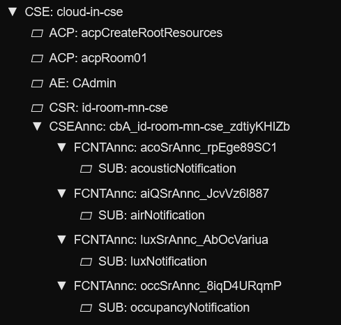

# Cloud Infrastructure (IN-CSE)

**2025 International oneM2M Hackathon**

Cloud platform for the Workspace Mood Monitor system. Runs oneM2M IN-CSE, ingests sensor telemetry, computes mood scores, controls LED feedback, and provides Grafana dashboards.




## Services

| Service | Purpose | Port |
|---------|---------|------|
| **acme** | oneM2M IN-CSE server | 8080 |
| **ingest** | Normalize telemetry, store in DB | 8088 |
| **ingest-worker** | Background queue processor | - |
| **mood-ml** | ML-powered mood scoring & LED control | 8090 (host), 8088 (container) |
| **postgres** | Database (telemetry + mood) | 5432 (internal) |
| **grafana** | Dashboards | 3000 |

## Setup

### Prerequisites
- Cloud VPS with public IP
- Docker + Docker Compose
- Ports: 8080 (CSE), 3000 (Grafana), 51820 (WireGuard)

### 1. Environment Configuration

Configure `docker-compose.yml` environment variables:
- `POSTGRES_PASSWORD` - Database password
- `GRAFANA_ADMIN_PASSWORD` - Grafana login
- `INCSE_HOST=10.100.0.1` - Cloud VPN IP
- `MNCSE_HOST=10.100.0.2` - Raspberry Pi VPN IP

### 2. Start Services

```bash
docker-compose up -d
docker ps  # Verify all containers running
```

### 3. Apply Database Migrations

```bash
for f in postgres/migrations/*.sql; do
  docker exec -i onem2m_postgres psql -U onem2m -d onem2m < "$f"
done
```

### 4. Access Grafana

Open `http://your-server-ip:3000`
- Username: `admin`
- Password: (set in `docker-compose.yml`)

## Verification

```bash
# Check CSE
curl http://localhost:8080/~/id-cloud-in-cse

# View telemetry
docker exec -i onem2m_postgres psql -U onem2m -d onem2m \
  -c "SELECT * FROM fact_telemetry ORDER BY ts_cse DESC LIMIT 5;"

# View ML mood scores
docker exec -i onem2m_postgres psql -U onem2m -d onem2m \
  -c "SELECT * FROM fact_mood_ml ORDER BY inserted_at DESC LIMIT 5;"

# Check ML service logs
docker logs -f mood-ml
```

## Machine Learning Mood Service

The mood-ml service uses a trained scikit-learn model to predict workspace mood scores based on sensor data.

**Key Features:**
- ML model predictions blended with heuristic fallback
- Runtime calibration via environment variables
- Per-room/desk sensor value caching
- Automatic LED color control
- Debug mode for model tuning

**Configuration:**
See [mood-service-ml/README.md](mood-service-ml/README.md) for:
- ML model training tutorial
- Environment variable tuning guide
- Feature engineering tips
- Alternative model architectures

**Quick tuning:**
```yaml
# docker-compose.yml - mood-ml service
environment:
  - ML_BLEND_HEURISTIC=0.2    # 0=pure ML, 1=pure heuristic
  - SOFTENING_FACTOR=0.9       # Score smoothing
  - SCORE_BIAS=10              # Positive bias for borderline scores
  - THRESHOLD_FOCUS=70         # "focus" label threshold
  - MOOD_ML_DEBUG=1            # Enable debug output
```

## WireGuard VPN

See [wireguard-onem2m-setup/README.md](wireguard-onem2m-setup/README.md) for VPN setup.

**Network**: `10.100.0.0/24`
- Cloud hub: `10.100.0.1`
- Edge nodes: `10.100.0.2-4`

## Data Flow

```
MN-CSE → WireGuard VPN → IN-CSE (8080)
                            ↓
                      Ingest (8088)
                            ↓
                      PostgreSQL
                            ↓
                Mood ML Service (8088)
                            ↓
                ┌───────────┴────────────┐
                ↓                        ↓
           PostgreSQL               LED Control
        (fact_mood_ml)            (via IN-CSE)
                ↓
            Grafana (3000)
```

## File Structure

```
cloud/
├── docker-compose.yml
├── cse/                       # ACME CSE config
├── ingest/                    # Flask normalization service
├── mood-service-ml/           # ML-powered mood computation (FastAPI)
├── postgres/                  # Database init + migrations
├── grafana/                   # Dashboard provisioning
└── wireguard-onem2m-setup/    # VPN tutorial + examples
```

## Troubleshooting

**Services won't start:**
```bash
docker-compose logs
docker-compose restart
```

**Database connection issues:**
```bash
docker exec -i onem2m_postgres psql -U onem2m -d onem2m -c "SELECT version();"
```

**CSE not accessible:**
```bash
docker ps | grep cloud-in-cse
docker logs cloud-in-cse --tail 50
```

## Security

- Change default passwords in `docker-compose.yml`
- Use firewall to restrict port access
- Only expose WireGuard (51820/udp) to public internet
- Access CSE/Grafana via VPN or reverse proxy with HTTPS

## Team VibeTribe

**Alper Ramadan, Benjamin Karic, Tahir Toy**

[Hackster.io Project](https://www.hackster.io/vibetribe/workspace-mood-monitor-c71c26)

## License

MIT
