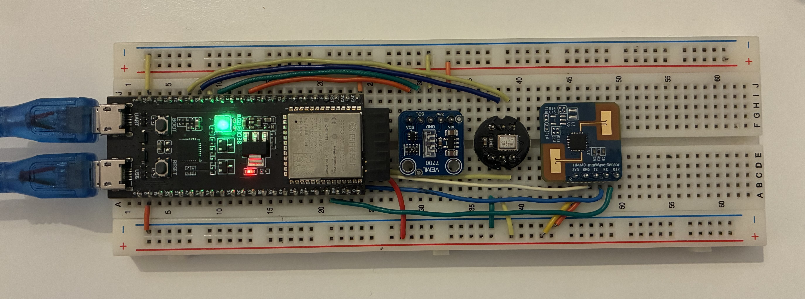

# ESP32 Sensor Node

**2025 International oneM2M Hackathon**

ESP32-S3 sensor node monitoring ambient environment (light, audio, occupancy) with RGB LED feedback. Connects to MN-CSE via oneM2M protocol and uses subscriptions for instant LED control.



## Hardware

| Component | Interface | GPIO |
|-----------|-----------|------|
| **VEML7700** (light) | I2C | SDA=8, SCL=9 |
| **INMP441** (audio) | I2S | SCK=12, WS=11, SD=10 |
| **S3KM1110** (occupancy) | UART+GPIO | TX=17, RX=18, OT2=1 |
| **WS2812** (LED) | NeoPixel | DIN=38 |

**Board:** ESP32-S3-DevKitC-1

## Features

- Multi-threaded FreeRTOS (sensors + LED on separate cores)
- oneM2M FlexContainer resources
- Subscription-based LED control (<100ms response)
- Threshold-based sensor reporting (10s polling)
- HTTP notification server (port 8888)

## Configuration

Edit `include/config.h`:

```cpp
// WiFi
#define WIFI_SSID "your-network"
#define WIFI_PASSWORD "your-password"

// oneM2M MN-CSE
#define CSE_HOST "192.168.x.x"  // Raspberry Pi IP
#define CSE_PORT 8081
#define CSE_NAME "room-mn-cse"
#define AE_NAME "moodMonitorAE"
#define ROOM_CONTAINER "Room01"
```

## Build & Upload

```bash
pio run -t upload
pio device monitor
```

## OneM2M Resource Structure

```
MN-CSE/moodMonitorAE/Room01/
├── luxSensor (mio:luxSr)
│   └── lux: float
├── acousticSensor (cod:acoSr)
│   └── louds: float
├── occupancySensor (mio:occSr)
│   └── occ: boolean
└── lamp (cod:devLt)
    ├── binarySwitch (cod:binSh)
    │   └── state: boolean
    └── color (cod:color)
        ├── red: int (0-255)
        ├── green: int (0-255)
        └── blue: int (0-255)
```

## Operation

### Sensor Tasks (Core 1)
- **Lux**: Reads every 10s, reports if change ≥1.0 lux
- **Audio**: Samples I2S, calculates RMS, reports if change ≥5.0
- **Occupancy**: Polls GPIO, reports on state change

### LED Actuator (Core 0)
- Creates subscriptions to `lamp/binarySwitch` and `lamp/color`
- HTTP server on port 8888 receives oneM2M notifications
- Updates NeoPixel at 10Hz based on mood score

### Notification Flow
1. Mood service computes score
2. Mood service PUTs color to MN-CSE lamp resource
3. MN-CSE sends HTTP POST to ESP32 notification URL
4. ESP32 parses notification, updates LED instantly

## Serial Output Example

```
=== VibeTribe Mood Monitor ===
Connecting to YourNetwork... connected
IP: 192.168.1.100
Waiting for CSE... ready
Lux sensor ready
Audio sensor ready
Occupancy sensor ready
Lamp device ready
Notification server started on port 8888
Subscription 'subLampSwitch' created
Subscription 'subLampColor' created

System ready

Lux: 25.3 lux
Audio: 48.9
Occupancy: EMPTY
LED: ON, R255 G200 B100
```

## File Structure

```
esp32_sensornode/
├── include/
│   ├── config.h            # WiFi, CSE settings
│   ├── onem2m.h            # oneM2M protocol
│   ├── lux_sensor.h        # VEML7700
│   ├── audio_sensor.h      # INMP441
│   ├── occupancy_sensor.h  # S3KM1110
│   └── led_actuator.h      # NeoPixel + subscriptions
├── src/
│   ├── main.cpp
│   ├── onem2m.cpp
│   ├── lux_sensor.cpp
│   ├── audio_sensor.cpp
│   ├── occupancy_sensor.cpp
│   └── led_actuator.cpp
└── platformio.ini
```

## Troubleshooting

**WiFi won't connect:**
- Check SSID/password in `config.h`
- Verify 2.4GHz network (ESP32 doesn't support 5GHz)

**CSE not reachable:**
- Ping MN-CSE: `ping 192.168.x.x`
- Check CSE_HOST in `config.h`
- Verify MN-CSE is running

**Sensors not working:**
- Check wiring matches GPIO table
- Monitor serial output for errors
- Verify I2C/I2S/UART initialization

**LED not updating:**
- Check notification server started (port 8888)
- Verify subscriptions created
- Check MN-CSE can reach ESP32 IP

## Dependencies

From `platformio.ini`:
- Adafruit VEML7700 Library ^2.1.6
- ArduinoJson ^6.21.3
- Adafruit NeoPixel ^1.12.0

## Team VibeTribe

**Alper Ramadan, Benjamin Karic, Tahir Toy**

[Hackster.io Project](https://www.hackster.io/vibetribe/workspace-mood-monitor-c71c26)

## License

MIT
