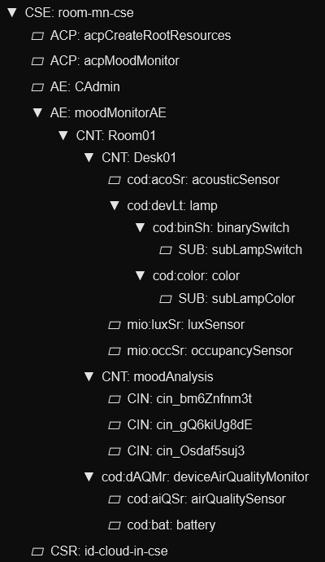

# Raspberry Pi MN-CSE

**2025 International oneM2M Hackathon**

Raspberry Pi running a Middle Node CSE that bridges local BLE sensors to the cloud IN-CSE. Collects data from SwitchBot Meter Plus (CO₂, temperature, humidity) and forwards to cloud via WireGuard VPN.



## Components

| Component | Purpose |
|-----------|---------|
| **ACME MN-CSE** | Local oneM2M server |
| **SwitchBot Service** | BLE scanner for CO₂/temp/humidity |
| **WireGuard VPN** | Secure tunnel to cloud |

## Hardware

- Raspberry Pi 3B+/4
- Bluetooth adapter (built-in or USB)
- SwitchBot Meter Plus (CO₂ sensor)
- WireGuard VPN to cloud (10.100.0.0/24)

## Setup

### 1. Install Prerequisites

```bash
sudo apt update
sudo apt install docker.io docker-compose wireguard -y
sudo usermod -aG docker $USER
```

### 2. Configure WireGuard VPN

See [wireguard_tutorial.md](wireguard_tutorial.md) for VPN setup.

### 3. Find SwitchBot MAC Address

```bash
sudo hcitool lescan
# Look for "WoIOSensorTH" device
```

### 4. Configure Environment

```bash
cd raspberry_mn-cse
nano .env
```

Update:
- `SWITCHBOT_MAC` - Your SwitchBot device MAC
- `MNCSE_HOST=10.100.0.2` - Your Pi's VPN IP
- `INCSE_HOST=10.100.0.1` - Cloud server VPN IP

### 5. Start Services

```bash
docker-compose up -d
docker-compose logs -f
```

## Verification

```bash
# Check MN-CSE
curl http://localhost:8081/room-mn-cse

# Check sensor data
curl -H "X-M2M-Origin: CAdmin" \
     -H "X-M2M-RI: test123" \
     -H "X-M2M-RVI: 3" \
     http://localhost:8081/room-mn-cse/moodMonitorAE/Room01/deviceAirQualityMonitor/airQualitySensor

# Watch sensor logs
docker logs -f switchbot-sensor
```

Expected output:
```
[2025-11-16 10:30:35] Sensor updated: Temp=23.5C, Humidity=45%, CO2=850ppm
```

## SwitchBot Sensor Details

**BLE Manufacturer Data Format:**
- Bytes 8-9: Temperature (signed, 0.1°C resolution)
- Byte 10: Humidity (0-100%)
- Bytes 13-14: CO₂ (ppm, big-endian)

**Update Interval:** 60 seconds

## Troubleshooting

**BLE connection issues:**
```bash
sudo systemctl status bluetooth
sudo hcitool lescan
sudo hciconfig hci0 down && sudo hciconfig hci0 up
```

**CSE connection issues:**
```bash
ping 10.100.0.1  # Test VPN
curl http://10.100.0.1:8080/cloud-in-cse  # Test cloud CSE
docker-compose restart
```

**Check logs:**
```bash
docker-compose logs switchbot-sensor
docker-compose logs acme-onem2m-cse
```

## File Structure

```
raspberry_mn-cse/
├── docker-compose.yml
├── .env.example
├── wireguard_tutorial.md
├── cse/                    # ACME MN-CSE data
└── sensor/                 # SwitchBot BLE service
    ├── Dockerfile.sensor
    └── switchbot-sensor.py
```

## Integration

This MN-CSE announces sensor data to the cloud IN-CSE where:
1. Ingest service normalizes and stores in PostgreSQL
2. Mood service computes workspace mood score
3. Results visualized in Grafana
4. Mood CIN sent back to control ESP32 LED indicators

## Team VibeTribe

**Alper Ramadan, Benjamin Karic, Tahir Toy**

[Hackster.io Project](https://www.hackster.io/vibetribe/workspace-mood-monitor-c71c26)

## License

MIT
